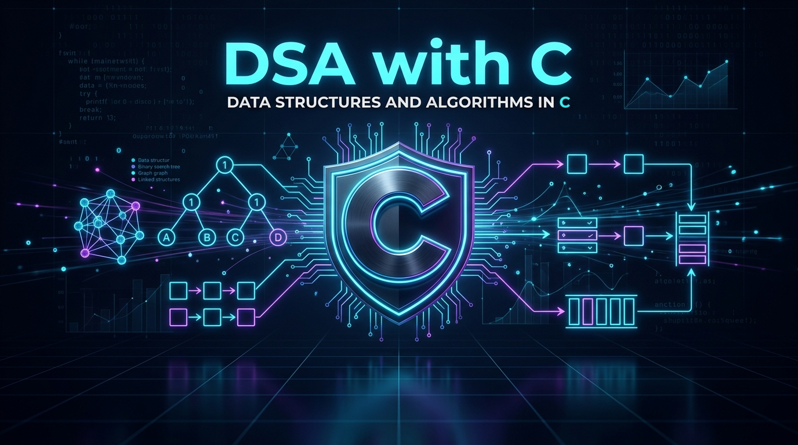

<!-- markdownlint-disable MD033 MD041 MD023 -->
<div align="center">

  

  # DSA with C 🚀
  
  **A structured, hands-on roadmap to mastering Data Structures and Algorithms from ground up using pure C.**

  [](https://en.wikipedia.org/wiki/C_(programming_language))
  [](https://github.com/)
  [](https://github.com/)
  [](LICENSE)

</div>
<!-- markdownlint-enable MD033 MD041 MD023 -->

---

## 📌 Overview

Welcome to the **DSA with C** repository! This repository documents a comprehensive journey from C language fundamentals to advanced Data Structures, Algorithms, problem-solving techniques, and time/space complexity analysis.

Every concept is accompanied by clean, well-commented code implementations designed to build deep conceptual clarity—especially around manual memory management and pointers.

---

## 🧭 Learning Roadmap & Progress

| # | Topic Module | Description | Status |
| --- | --- | --- | :---: |
| 01 | **[01-C-Basics](./01-C-Basics/)** | Syntax, Data Types, Variables, Arithmetic & Logical Operations, I/O | 🟡 In Progress |
| 02 | **[02-Control-Flow](./02-Control-Flow/)** | If-Else, Switch-Case, For/While/Do-While Loops | ⚪ Upcoming |
| 03 | **[03-Functions-Scope](./03-Functions-Scope/)** | Modular programming, Call by Value/Reference, Scope rules | ⚪ Upcoming |
| 04 | **[04-Arrays-Strings](./04-Arrays-Strings/)** | 1D/2D Arrays, String manipulations, Memory layout | ⚪ Upcoming |
| 05 | **[05-Pointers-Memory](./05-Pointers-Memory/)** | Pointer arithmetic, `malloc`, `calloc`, `realloc`, `free`, double pointers | ⚪ Upcoming |
| 06 | **[06-Structures-Unions](./06-Structures-Unions/)** | Custom data structures, Nested structs, Self-referential structs | ⚪ Upcoming |
| 07 | **[07-Linked-Lists](./07-Linked-Lists/)** | Singly, Doubly, and Circular Linked Lists | ⚪ Upcoming |
| 08 | **[08-Stacks-Queues](./08-Stacks-Queues/)** | Array & Linked list implementations, Applications | ⚪ Upcoming |
| 09 | **[09-Trees](./09-Trees/)** | Traversals (Inorder, Preorder, Postorder, BFS), BST operations | ⚪ Upcoming |
| 10 | **[10-Heaps-Priority-Queues](./10-Heaps-Priority-Queues/)** | Min-Heap, Max-Heap, Heap Sort | ⚪ Upcoming |
| 11 | **[11-Hashing](./11-Hashing/)** | Collision handling, Chaining, Open Addressing | ⚪ Upcoming |
| 12 | **[12-Graphs](./12-Graphs/)** | BFS, DFS, Dijkstra, Prim, Kruskal | ⚪ Upcoming |
| 13 | **[13-Searching-Sorting](./13-Searching-Sorting/)** | Binary Search, Quick Sort, Merge Sort, Counting Sort | ⚪ Upcoming |
| 14 | **[14-Recursion-Backtracking](./14-Recursion-Backtracking/)** | Subsets, Permutations, N-Queens, Maze algorithms | ⚪ Upcoming |
| 15 | **[15-Dynamic-Programming](./15-Dynamic-Programming/)** | Memoization, Tabulation, Knapsack, LCS | ⚪ Upcoming |
| 16 | **[16-Greedy-Algorithms](./16-Greedy-Algorithms/)** | Activity Selection, Fractional Knapsack, Huffman Coding | ⚪ Upcoming |

---

## 📂 Repository Structure

```plaintext
DSAwithC/
├── assets/
│   └── banner.png                  # Project banner
├── utils/
│   └── dsa_utils.h                 # Reusable DSA test & helper utilities
├── docs/
│   └── README.md                   # Big-O cheatsheet & memory debugging guides
├── practice-problems/
│   └── README.md                   # LeetCode / competitive programming problems
├── 01-C-Basics/
│   ├── README.md                   # Module guide & notes
│   ├── hello.c                     # Hello World & basic I/O
│   ├── data_types.c                # Primitive data types (int, float, double, char)
│   ├── variables.c                 # Variables & format specifiers
│   ├── variable_calculation.c      # Arithmetic operations & calculations
│   ├── arithmetic_operators.c      # Arithmetic operators (+, -, *, /, %)
│   ├── relational_operators.c      # Relational operators (>, <, ==, !=)
│   └── logical_operators.c         # Logical operators (&&, ||, !)
├── 02-Control-Flow/
├── 03-Functions-Scope/
├── 04-Arrays-Strings/
├── 05-Pointers-Memory/
├── 06-Structures-Unions/
├── 07-Linked-Lists/
├── 08-Stacks-Queues/
├── 09-Trees/
├── 10-Heaps-Priority-Queues/
├── 11-Hashing/
├── 12-Graphs/
├── 13-Searching-Sorting/
├── 14-Recursion-Backtracking/
├── 15-Dynamic-Programming/
├── 16-Greedy-Algorithms/
├── .vscode/
│   ├── c_cpp_properties.json
│   ├── launch.json
│   └── settings.json
├── .gitignore
└── README.md
```

---

## 💻 Code Highlights (`01-C-Basics`)

- [`hello.c`](./01-C-Basics/hello.c): Standard introduction to basic C structure and console output.
- [`data_types.c`](./01-C-Basics/data_types.c): Demonstrates primitive data types (`int`, `float`, `double`, `char`) and precise formatted printing.
- [`variables.c`](./01-C-Basics/variables.c): Demonstrates integer, float, character, and string variables along with formatting specifiers (`%d`, `%f`, `%c`, `%s`).
- [`variable_calculation.c`](./01-C-Basics/variable_calculation.c): Covers basic arithmetic operations (sum, difference, product) and formatted outputs.
- [`arithmetic_operators.c`](./01-C-Basics/arithmetic_operators.c): Demonstrates addition, subtraction, multiplication, integer division, and modulus operations.
- [`relational_operators.c`](./01-C-Basics/relational_operators.c): Demonstrates comparison conditions producing boolean evaluations (1 for True, 0 for False).

---

## ⚙️ Getting Started

### Prerequisites

You need a C compiler installed on your system:

- **Windows:** [MinGW-w64](https://www.mingw-w64.org/) or [MSYS2](https://www.msys2.org/)
- **Linux:** `sudo apt install build-essential`
- **macOS:** `xcode-select --install`

Verify your compiler:

```bash
gcc --version
```

### Compiling and Running Programs

Navigate to any topic folder and compile with `gcc`:

```bash
# Example: Running variable calculation
gcc 01-C-Basics/variable_calculation.c -o 01-C-Basics/variable_calculation
./01-C-Basics/variable_calculation
```

On Windows (Command Prompt / PowerShell):

```powershell
gcc 01-C-Basics/variable_calculation.c -o 01-C-Basics/variable_calculation.exe
.\01-C-Basics\variable_calculation.exe
```

---

## 🤝 Contributing

Contributions, issues, and feature suggestions are welcome!
If you find a bug or have an optimized solution for any DSA problem, feel free to open a Pull Request.

---

## 📜 License

This project is licensed under the [MIT License](LICENSE).
